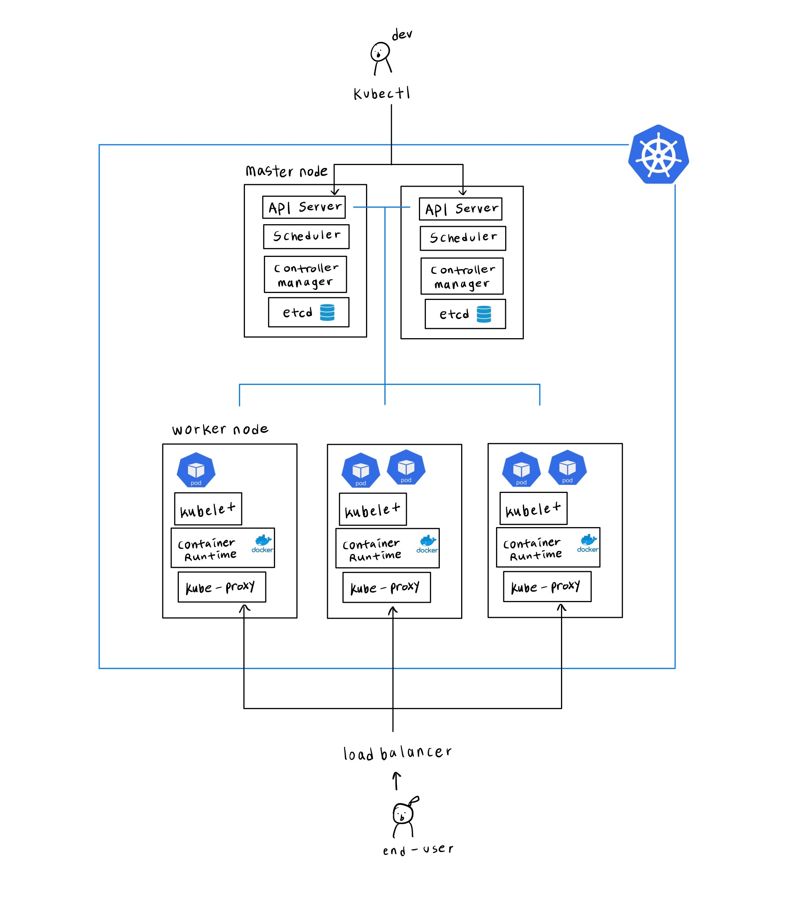
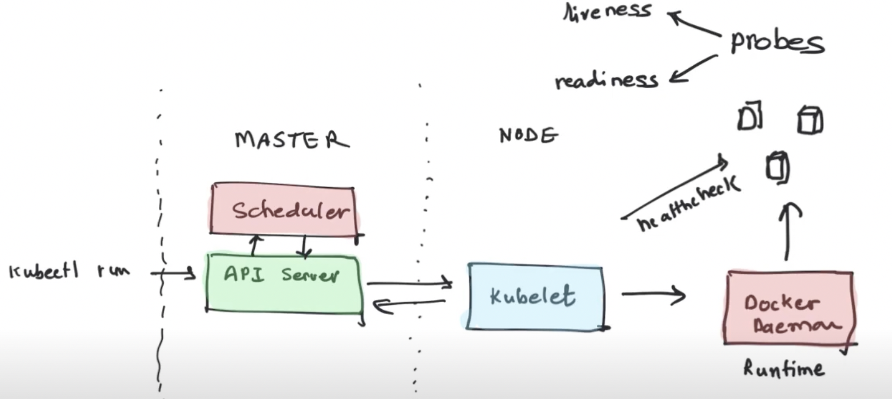

Basic Architecture
==================

[kubernetes components](https://kubernetes.io/docs/concepts/overview/components)

cluster
-------
set of nodes

node
----
machine. physical or virtual

worker node
-----------
실제로 app 컨테이너를 실행시키는 노드.   
클러스터 수뇌부

### worker node에 설치되어야 하는 프로세스 3가지
ㄴ 이 프로세스들도 컨테이너 형태로 동작합니다.

#### container runtime 
container daemon. 컨테이너를 실행하기 위한 환경을 제공하는 소프트웨어.  
도커가 가장 유명하지만 그 외 containerd, CRI-O, Mirantis 등 다른 여러 컨테이너 런타임과도 호환됩니다.  
- pull image from container registry (docker hub, ECR, GCR..)
- start/stop container

#### kubelet
API Server <-> container runtime 사이에서 통신하면서 pod가 잘 동작하도록 관리하는 agent.  
- pod 실행 : config 대로 새로운 pod로 node의 resource (cpu, mem)을 할당해주면서 pod 내에서 container가 잘 start할 수 있도록 합니다  
- health check : node, pod 상태를 master에 보고합니다.   
probe - readiness, liveness, startup. kubelet에 의해서 주기적으로 실행되는 pod 진단 

#### kube-proxy
network proxy. 쿠버네티스 "Service" 개념을 구현하는 요소 중 하나입니다.  
maintain network rule on node, forwarding requests.  

master node
-----------
control plane 역할을 하는 노드

### master node에 설치되어야 하는 프로세스 4가지

#### API Server
cluster로의 유일한 entry point. 심지어 worker node도 API Server를 통해 마스터와 통신합니다.  
API Server와 통신하기 위한 여러 client (ui, cli=kubectl, api)가 있는데 그 중 kubectl이 가장 강력한 기능을 제공합니다.  
cluster로의 요청에 대한 인증/인가를 위한 gatekeeper로서의 역할을 담당하기도 합니다.  
some request -> (expose 443 Port) API Server -> validate request -> forward to other process 
horizontally scale out 될 수 있게 설계되어서 트래픽이 여러 api-server 서버로 로드밸런싱 됩니다.

#### Scheduler
어느 worker 노드에서 새로운 pod를 실행할지 결정합니다.   
node의 available resource, `affinity`/`anti-affinity` 등 여러가지를 고려하여 어느 node로 스케줄링 할지 결정합니다.  
어느 node에 스케줄되게 할지 결정하는 것 까지만 scheduler가 담당하고, 실질적으로 pod start 하는건 kubelet이 담당합니다.

#### Controller Manager
`desired state` == `current state` 인지 체크, 유지하도록 하는 역할을 합니다.  
예를 들면 pod가 죽은 것을 감지해 스케줄러를 통해 restart 되도록 하는 것과 같은.  

논리적으로 각 controller는 별개의 프로세스 이지만, 복잡도를 줄이기 위해서 이 controller들이 하나의 binary로 컴파일 되어 실행되는데 이게 바로 controller manager 프로세스 입니다.

참고로 컨트롤러란 non-terminating control loop을 돌면서 클러스터 내 각 자원의 상태를 체크하고, (보통) yaml 파일로 설정한 desired 상태와 현재 실제 자원의 상태를 같도록 합니다. Deployment, StatefulSet, Job 같은 것들이 바로 컨트롤러 입니다. 

#### etcd
distributed, high-available key-value store.   
scheduler에게 필요한 available resource 정보, cm이 필요한 cluster config, state 정보와 같은 모든 cluster 변경사항은 여기에 저장됩니다.  
서로 다른 master node에 분산된 etcd 간의 consensus 알고리즘으로는 `RAFT`를 사용한다고 합니다.  
[Raft Documentation](https://raft.github.io/)  

pod
---
smallest unit.  
wrapper of container.  
각자 클러스터 안에서 식별 가능한 internal ip address를 가지고 있습니다.
보통 pod 마다 1개의 app 컨테이너 + proxy나 agent 역할 하는 1-2가지 컨테이너 추가. 이런 식으로 동작합니다.

Add-ons
-------
#### coredns
클러스터 dns 서버. 

#### cni
container network interface.  
network를 위한 플러그인
