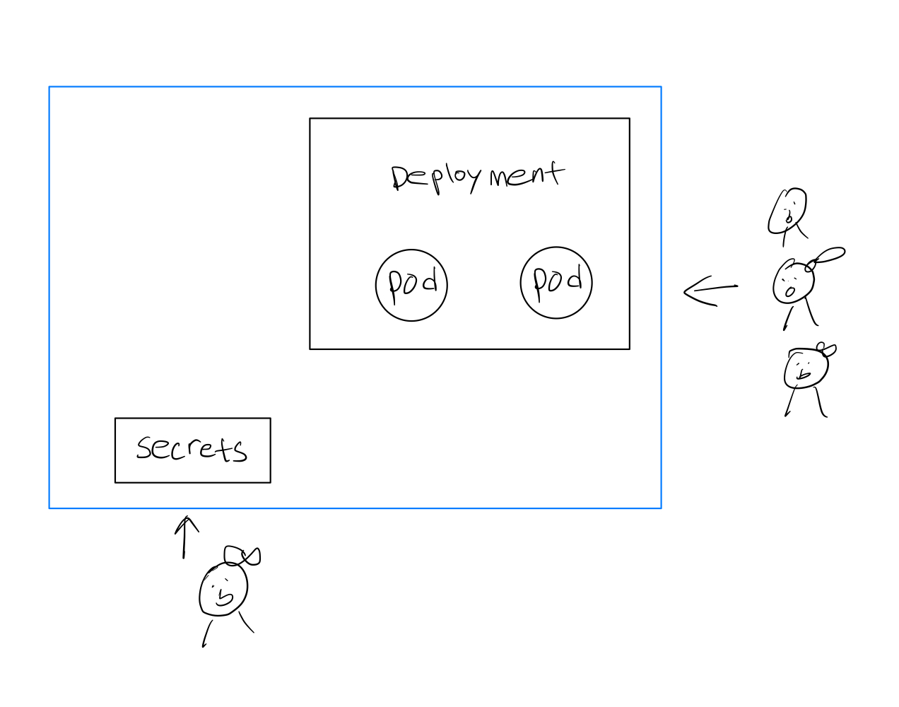

ConfigMap
=========
[configmap documentation](https://kubernetes.io/docs/concepts/configuration/configmap/)  
pod에서 사용 될 key-value 데이터를 저장하는데 사용되는 쿠버네티스 object 입니다.   

pod에서 다음과 같은 값들로 ConfigMap을 사용할 수 있습니다. 
- 환경 변수
- command-line arguments
- pod volume에 config file로 마운트하기  

ConfigMap은 컨테이너 이미지(app)와 config를 decouple해서 관리할 수 있도록 해줍니다.   


Secrets
=======
token, password, key같은 민감 정보를 저장하는데 사용되는 object입니다.  

사용할 때 주의할 점은, Secrets의 value 부분에는 base64 인코딩된 값을 넣어야합니다.  
`type` : `Opaque`가 default 이고 임의의 key-value secret pair를 저장하는데 사용됩니다. [secret-types](https://kubernetes.io/docs/concepts/configuration/secret/#secret-types)

secret을 사용하면 불필요하게 credential value를 여러 사람에게 공유할 필요 없이, 권한을 가진 소수만이 클러스터에 secrets 객체를 create, update하고 나머지는 여기서 값을 불러들여서 사용할 수 있으니 좋겠죠.  
RBAC 롤바인딩을 통해 누가 이 secret 객체에 대한 접근 권한을 가지는지도 컨트롤할 수 있습니다.



하지만 쿠버네티스가 실질적으로 secrets을 통해서 암호화 처리를 해주지는 않습니다. (base64 디코딩은 누구나 할 수 있잖아요?). encryption 사용하려면 key vault와 같은 3rd party 툴을 사용할 것을 권장합니다.


실습
--- 
ConfigMap 파일 예시
```yaml
apiVersion: v1
kind: ConfigMap
metadata:
  name: hello-config
data:
  db_url: "database1"
  my_name: "kubernetes"
```

Secrets 파일 예시
```yaml
apiVersion: v1
kind: Secret
metadata:
  name: hello-secret
type: Opaque
data:
  db_password: cGFzc3dvcmQ=
  my_password: MTExMQ==
```

(참고) 터미널에서 base64 인코딩, 디코딩하기
```
echo -n 'password' | base64
echo cGFzc3dvcmQ= | base64 -d
```

deployment에서 다음과 같이 configMap, secrets에서 값을 가져와서 컨테이너 환경변수로 지정할 수 있습니다.
```yaml
    (생략...)
    ports:
    - containerPort: 8080
    env:
    # 컨테이너 환경변수 바로 적기
    - name: my_age
        value: '100'
    # configMap에서 가져온 값 사용하기
    - name: my_name
        valueFrom: 
        configMapKeyRef:
            name: hello-config
            key: my_name 
    - name: database
        valueFrom:
        configMapKeyRef:
            name: hello-config
            key: db_url
    # secret 에서 가져온 값 사용하기
    - name: password
        valueFrom:
        secretKeyRef:
            name: hello-secret
            key: db_password
```

이제 로컬 클러스터에서 실습을 진행해봅시다.
```
kubectl apply -f configmap_secrets/configmap.yaml
kubectl apply -f configmap_secrets/secrets.yaml
kubectl apply -f configmap_secrets/deployment.yaml
```
pod가 running 상태가 될때까지 기다렸다가 그 중 하나의 pod에 interactive mode로 접속해서 환경변수를 출력해봅시다.
```
kubectl get pods --watch

kubectl exec -it <pod> -- bash

echo $database
echo $password
echo $my_name
echo $my_age
```
특히 secrets에서 값을 가져온 password를 출력해보면 base64 디코딩된 평문이 출력됨을 확인할 수 있습니다.