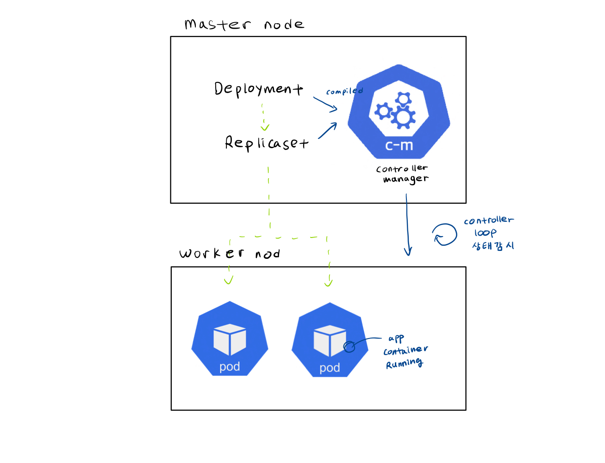
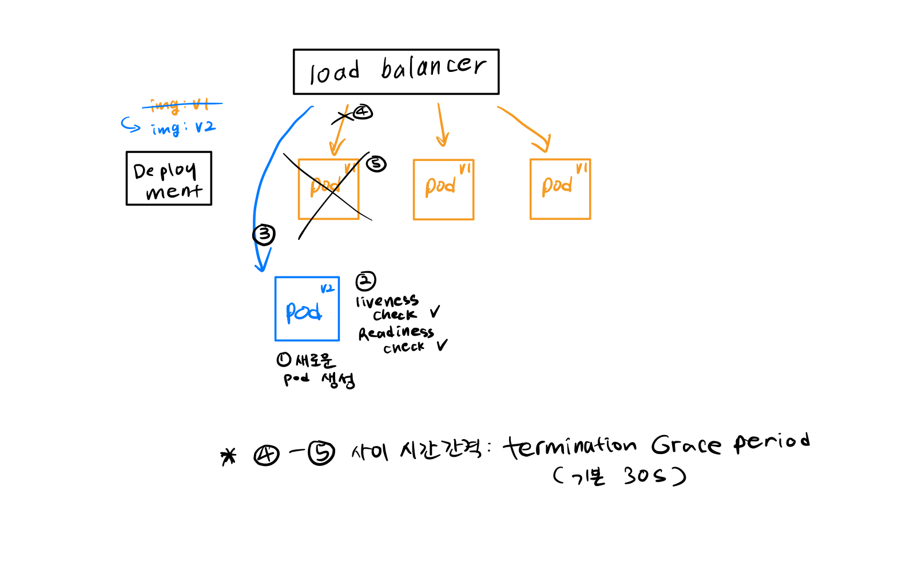

Deployment
==========
[deployments document](https://kubernetes.io/docs/concepts/workloads/controllers/deployment/)



app 컨테이너를 배포할 때 첫번째 pod 띄우고, 뭐하고, 그다음 이거 해라는 명령형 대신,   
클러스터 내에 pod들이 이런 개수, 상태로 돌아가고 있었으면 좋겠어! 라는 청사진만 제시하면  
control plane이 알아서 그 상태로 만들어주고, 유지시켜준다면 얼마나 좋을까요?  
pod가 죽었을 때, 명시한 replica 개수만큼 알아서 재실행도 해줍니다.  

Deployment는 Pod와 ReplicaSet에 대한 선언적(delcarative) 업데이트 수단입니다.  
Deployment에 `desired state`를 명시하면 Deployment 컨트롤러가 클러스터의 `actual state`를 `desired state`로 만들어줍니다.  
Deployment를 통해 pod에는 어떤 이미지의 컨테이너를 동작시켜야 하는지, 몇 개의 pod를 실행시키면 되는지와 같은 것들을 선언적으로 정의합니다.

(참고)  
declarative programming vs imperative programming

pod
---
쿠버네티스에서 생성하고 관리할 수 있는 가장 작은 deployable 유닛.


replicaset
----------
언제나 안정적으로 특정 개수만큼의 replica Pods 셋이 동작하고 있을 수 있도록 관리하는 컨트롤러.   
실전에서 replicaset을 직접 CRUD할 일은 없고, deployment를 통해 선언적으로 정의합니다.


deployment
----------
deployment --> ReplicaSet --> Pods  --> Container


실습
---

로컬 클러스터를 하나 생성합니다
```
minikube start
```

watch command로 리소스를 모니터링 하면서 deployment를 생성해봅시다.
```
watch kubectl get all

kubectl apply -f deployment/deployment.yaml
```

잠깐) yaml 파일 구성 요소를 뜯어봅시다. 모든 configuration은 3 파트로 구성되어 있습니다.
1) metadata
2) spec
3) status   
쿠버네티스에 의해 자동으로 생성, 관리 됩니다. `desired state` =? `actual state(status)` 인지 계속 확인하는데 사용됩니다.   
이 status 정보는 저번에 다뤘던 마스터 노드의 etcd에서 가져 옵니다.

deploymnet의 `spec.template` 도 metadata 와 spec 섹션으로 이루어져 있는데, 이 부분은 pod에 대한 config입니다.  

#### connecting componenets
[labels and selectors](https://kubernetes.io/docs/concepts/overview/working-with-objects/labels/)  
`metadata.labels` : 이 항목을 통해서 deployment, pod, service 같은 리소스에 key-value pair를 부여합니다.  
`spec.selector` : 리소스를 여기에 주어진 값과 매치되는 componenet와 연결합니다. (`spec.selector.matchLabels` or `spec.selector.matchExpression`)

예) service의 `spec.selector` - deployment, pod의 `metadata.labels`  
deployment의 `spec.selector` - pod의 `metadata.labels`

다음과 같은 커맨드를 직접 쳐보세요  

클러스터에 생성된 리소스 보기
```
kubectl get pods
kubectl get replicaset
kubectl get deploy
kubectl get all
```

디버깅
```
kubectl logs <pod>
kubectl logs -f <pod> -c <container>
kubectl describe pod <pod>
kubectl exec -it <pod> -- bin/bash
```


포트 포워딩으로 배포된 app에 접속도 해봅시다.  
[access cluster by port-forward](https://kubernetes.io/docs/tasks/access-application-cluster/port-forward-access-application-cluster/)  
```
kubectl port-forward pods/<pod> 8080:8080
(or)
kubectl port-forward deployment/hello-world 8080:8080
(or)
kubectl port-forward replicaset/<replicaset> 8080:8080

curl localhost:8080
```

삭제하기
```
kubectl delete -f deployment/deployment.yaml
```


zero-downtime update
--------------------
#### pod update strategy
`.spec.strategy` 는 old pod를 new pod로 업데이트 할 방식을 정의하는 부분입니다.  
`.spec.strategy.type` 값으로는 `Recreate`나 `RollingUpdate`가 올 수 있는데, `RollingUpdate`가 디폴트 값입니다.

Recreate : 새로운 pod를 생성하기 전에 모든 old pod를 먼저 죽입니다. 모든 pod shutdown - 새로운 pod 부팅하는 사이에 downtime 발생 가능합니다.  
RollingUpdate : pod를 하나 하나씩 새로운 것으로 업데이트 합니다. Recreate 방식 보다는 느릴 수 있지만 zero-downtime을 보장합니다.

[참고 - kubernetes deployment strategy](https://blog.container-solutions.com/kubernetes-deployment-strategies)  


#### container probe
probe는 kubelet에 의해서 주기적으로 container에 행해지는 진단입니다. 컨테이너 안에서 code를 실행시키거나, network request를 보내는 방식으로 진단합니다.

[types of probe](https://kubernetes.io/docs/concepts/workloads/pods/pod-lifecycle/#types-of-probe)  
`livenessProbe` : container가 제대로 running하고 있는지 확인합니다. 여기서 fail을 받으면 kubelet이 container를 죽이고 restartPolicy에 따라 재시작하도록 합니다.     
`readinessProbe` : container가 request에 응답 할 준비가 되어있는지 확인합니다. 여기서 fail하면 이 pod가 연결되어 있는 모든 service의 endpoint에서 해당 pod IP 주소를 삭제합니다. (이 pod로 트래픽이 로드밸런싱 되지 않도록.)  
`startupProbe` : container안의 app이 실행되었는지 확인합니다. 여기서 fail하면 livenessProbe과 마찬가지로 container를 죽이고 다시 시작합니다.


#### zero-downtime update
pod 업데이트 strategy를 `RollingUpdate`로 했을 경우 다음과 같이 동작합니다.



이렇게 pod 한개씩 차례로 update 됩니다.   
termination Grace period 동안은 더이상 새로운 트래픽은 전달되지 않도록 끊은 뒤, 이미 받은 request를 처리 할 동안은 pod를 살려두는 시간입니다. 