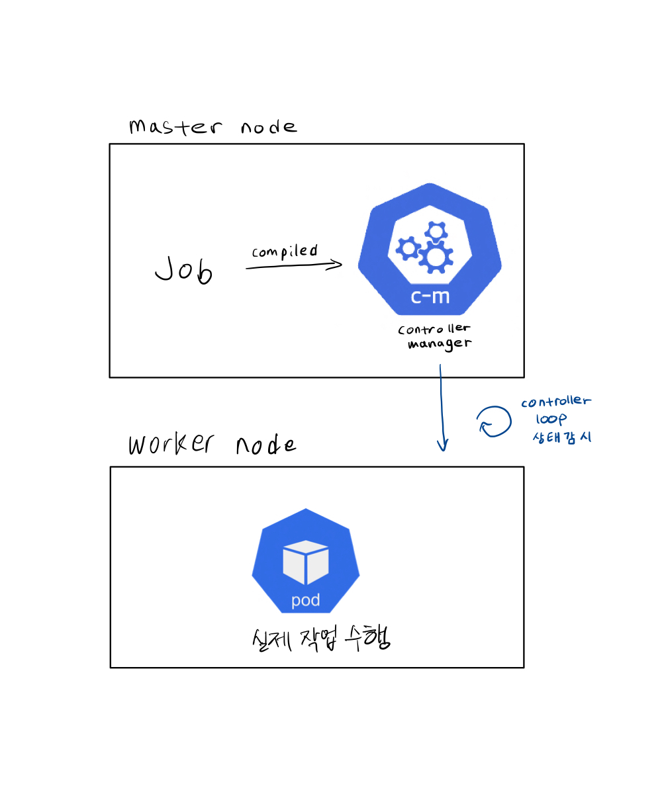
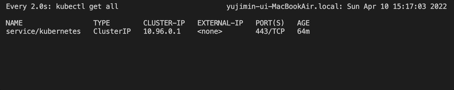
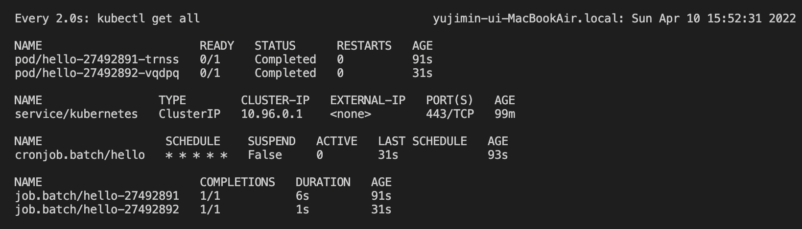

Job
===
[jobs documentation](https://kubernetes.io/docs/concepts/workloads/controllers/job/)
  

명시한 컨테이너 이미지로 만든 pod에서 원하는 command를 수행하도록 관리하는 controller.  
```
Job --> Create Pod --> Exec command
```

실습
---
```
minikube start

watch kubectl get all

kubectl apply -f job/job.yaml
```
  

job command가 잘 실행 되었는지 로그도 찍어봅시다.  
describe는 job 시작, 종료 시각과 실패, 성공 개수도 보여줍니다.
```
kubectl logs <pod>

kubectl describe job hello
```

#### 실패 관리
job completion 전에 pod가 죽으면, Job 컨트롤러가 새로운 pod를 띄워서 해당 잡을 수행하게 합니다.  
`spec.backoffLimit` 로 retry 횟수를 지정할 수 있습니다.
실패 횟수가 이 숫자를 넘어가면 잡 컨트롤러가 더이상 새로운 pod를 프로비저닝 하지 않습니다.

#### 실행 횟수, 병렬 실행
`spec.completions` 에 job을 수행하고 싶은 횟수를 적습니다.  
기본적으로 첫번째 pod가 완료된 뒤 다음 pod를 시작하는 식으로 하나씩 sequential하게 수행하지만, `spec.parallelism` 옵션으로 한번에 병렬으로 수행할 job 개수를 지정해줄 수도 있습니다.


CronJob
=======
[cronjob documentation](https://kubernetes.io/docs/concepts/workloads/controllers/cron-jobs/)  
Job을 정기적으로 실행하고 싶을 때
```
CronJob --(스케줄마다 정기적으로)--> Create Job Controller --> Create Pod --> Exec Command
```

실습
---
위에서 실습한 job을 삭제하고
```
kubectl delete job hello

(or)

kubectl delete -f job/job.yaml
```
CronJob을 생성해봅시다. 
```
watch kubectl get all

kubectl apply -f job/cron_job.yaml
```
`* * * * *` 로 스케줄 되어 있으므로 1분에 한번씩 Job 컨트롤러 생성하고, 그에 따른 Pod를 생성해서 잡을 실행할 것입니다.


#### 중지하기
이미 생성된 job, pod는 건드리지 않고 미래에 스케줄 될 job 부터 suspend합니다.  
`spec.backoffLimit` 옵션을 true로 바꾸면 (다시 false로 하거나 해당 옵션을 삭제 후 apply하기 전까지) 더이상 새로운 Job 컨트롤러를 생성하지 않습니다. 

