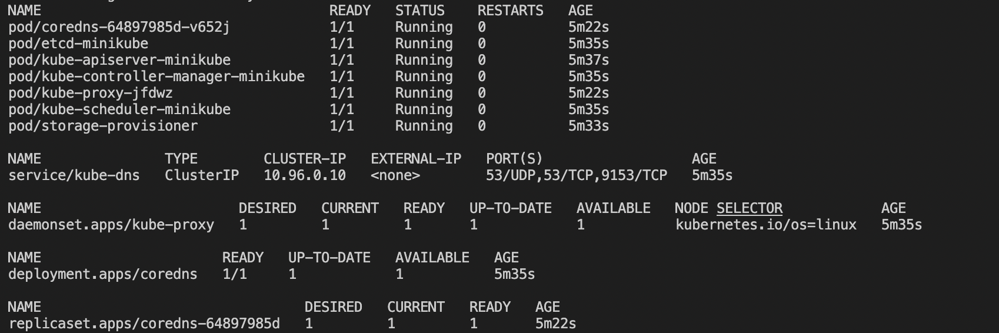

Namespaces
==========
클러스터에 생성하는 대부분의 리소스들은 논리적으로 한가지 namespace에 속하게됩니다.   
여태까지 신경을 안쓰고 있었지만, 사실 특별히 namespace를 지정하지 않고 행했던 명령이나 리소스 생성은 `default` 네임스페이스에서 이뤄지고 있었답니다.  
네임스페이스를 클러스터 속의 virtual 클러스터라고 생각해도 괜찮습니다.


실습
---
새로운 로컬 클러스터 생성
```
minikube start
```

#### default namespaces
```
kubectl get ns
```
`default` : 특별히 namespace를 지정하지 않은 리소스는 여기에 생성됩니다. kubectl 명령어도 -n 옵션으로 네임스페이스를 지정하지 않으면, default 네임스페이스에 대한 명령으로 내려집니다.  

```
kubectl get all -n kube-system
```


`kube-system` : kube-system 네임스페이스에는 쿠버네티스 시스템에서 필요한 object가 존재합니다. 유저가 이 네임스페이스를 건드릴 일은 없습니다.

`kube-public` : 모든 유저 (권한 상관 없이)에게 public하게 접근가능한 네임스페이스 입니다. 전 클러스터에서 public하게 access 가능해야 하는 데이터, cluster-info 등을 저장하는데 쓰입니다.

`kube-node-lease` : 이 네임스페이스에는 각 node와 연관된 Lease object가 있습니다. kubelet이 lease로 heartbeat을 전송해서 각 node의 availability를 파악하는데 사용합니다. 

#### 새로운 네임스페이스 생성하기
```
kubectl create namespace my-namespace

kubectl get ns
```

#### 네임스페이스 사용 예시
```yaml
apiVersion: v1
kind: ConfigMap
metadata:
  name: hello-config
  namespace: my-namespace
data:
  db_url: "database1"
```
리소스를 이런식으로 특정 네임스페이스에 create하거나
```
kubectl get pods -n my-namespace
```
특정 네임스페이스에서 리소스를 조회할 수 있습니다.

#### default로 사용하는 네임스페이스 변경하기
```
brew install kubectx

kubens
kubens my-namespace
```

사용하는 이유
----------
- 관련있는 리소스끼리 같은 네임스페이스에 묶어서 관리하기 편해진다. 예를들면 ELK 스택, 로깅, 모니터링, db 등
- 서로 다른 팀이 같은 클러스터를 사용할 때 실수로 같은 이름을 사용해서 overwrite 하거나 conflict가 일어나는 것을 방지하기 위해서, 네임스페이스를 분리하고 RBAC으로 권한도 서로 다르게 부여.
- dev, stage, prod environment를 같은 클러스터 내에서 네임스페이스로 분리하기. 혹은 Blue/Green deployment에도 사용가능. 


특징
---
네임스페이스별로 CPU, RAM, Storage 같은 자원 limit을 지정하는 것도 가능하다고 합니다.

보통 다른 네임스페이스의 리소스는 접근할 수 없는데, Service는 다른 네임스페이스에서도 접근 가능합니다.
`{서비스}.{네임스페이스}` 같은식으로 참조합니다.

Volume, node 같은 component는 특정 네임스페이스에서 생성될 수 없고 오직 전 클러스터에서 global하게만 생성 가능하다고 합니다. 