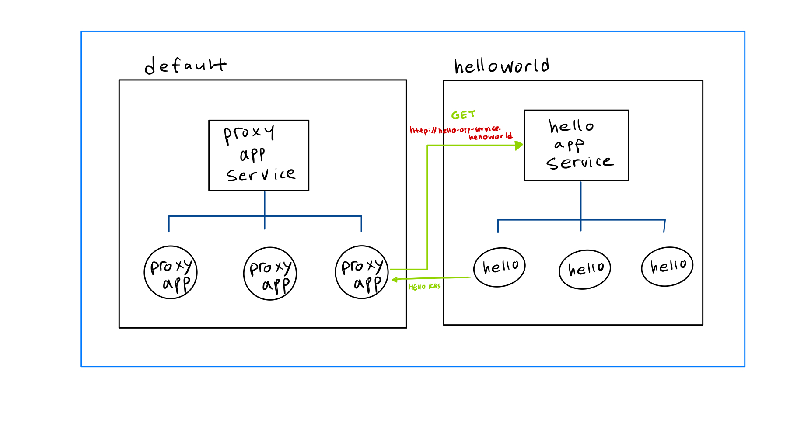
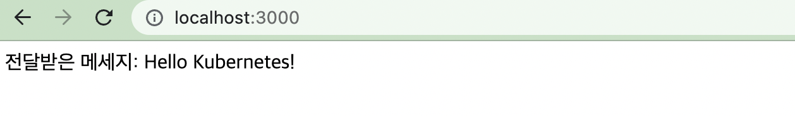

Service
=======
deployment를 통해 생성한 application pod에 클라이언트의 request를 어떻게 전달할까요?   
또, application pod에서 redis pod로 요청을 보내고 싶을 때 IP 주소를 어떻게 찾을까요?   
쿠버네티스의 네트워킹에 대해 알아봅시다.

서비스는 process가 아니라 abstract layer입니다.   
모든 pod는 클러스터 내부 IP를 부여받습니다. 그렇지만 pod는 금방 죽기도 하고, Restart  되기도 하는 존재이기 때문에 (ephemeral), 해당 app의 pod들과 안정적으로 네트워킹 하기위한 고정적인 IP 주소가 필요합니다.  
또한 stable IP address를 가진 서비스로 전달된 트래픽은 여러개의 pod로 로드밸런싱 됩니다.    
각 pod를 개별적으로 호출하는 대신, 서비스를 호출 하면 request를 (기본적으로는 round-robin 방식으로) 연결된 pod로 포워딩 해주니까 클러스터 객체간의 느슨한 결합, 추상화로 관리하기 좋아지겠죠.

> IP addresses assigned to pods are ephemeral and change every time a pod is created or deleted. Service provides a stable mechanism for connecting to a set of pods

서비스에게 부여된 Virtual IP는 고정적이고 변하지 않습니다.

service types
-------------
#### ClusterIP
default 타입. 특별히 type을 명시하지 않았을 때 서비스타입은 ClusterIP 입니다.  
오직 클러스터 내부에서만 접근 가능한 internal service 입니다.

 
서비스가 어떤 pod, port에 forwarding 해야하는지 어떻게 알고 있을까? 
- selector (member pod, endpoint pod )
- targetport

```yaml
ports:
  - protocol: TCP
  port: 3200   # arbitrary 
  targetPort: 3200   # has to match containerPort!
```

multiport service  
port 명세에 이름 부여할 것

서비스를 생성하면 서비스는 endpoint object를 생성함. 서비스와 같은 이름인
```
kubectl get endpoints
```
keeptrack of which pods are members/endpoints of service
pod에 변동 생길때마다 dynamic하게 최신 상태 유지. 
 


#### Headless
클라이언트/pod가 하나의 specific pod랑 direct 소통하고 싶을 때  

use case
- stateful application like databases. pod replicas are not identical / worker-master


해당 pod ip address를 얻는 방법
1) k8s api server에 api call
- 비효율적, app이 k8s api에 강결합되게 되서 별로 좋지 않음
2) DNS lookup
- 기본적으로는 서비스의 clusterIP를 되돌려주지만 headless로 지정하면 pod의 IP 리턴함.


setting clusterIP : none

일반적인 역할을 하는 ClusterIP 서비스를 두고, 직접 연결해야 하는 pod에 headless 서비스를 별도로 둔다. 

#### NodePort
clusterip : only accessible within cluster
no external traffic can directly  
nodeport : 각 worker node의 고정된 port를 통해서 접근 가능 하다.  

해당 포트번호는 nodeport attribute에 명시
30000 - 32767 사이의 값이어야함. 

이 타입의 서비스를 생성하면 모든 worker 노드의 노드포트가 오픈됨.

보안에 좋지 않음, 테스트를 위해서만 사용할 것.
not for production 

#### LoadBalancer
nodeport 보다 나은 대안. 
accessible externally through cloud providers loadbalancer
  
이 로드밸런서를 생성해서  거기를 통해서 external 트래픽을 받음. 
GCP, AWS, Azure, linode, openstack 등등

여기서 명시하는 nodeport는 worker node의 포트이긴 한데, 아무 클라이언트나 거기로 직접 접근 가능한게 아니라,  로드밸런서가.
extension of clusterip type 


원리
---
[kubernetes 네트워킹 원리](https://www.youtube.com/watch?v=xhva6DeKqVU&t=240s)  
[심화 이해 : kubernetes 내부의 packet flow](https://learnk8s.io/kubernetes-network-packets)  


 kube-proxy => manages  iptables on each worker node

 1) dns registry : coreDNS
 - nslookup
 2) iptables : kube-proxy
 -> 각 worker node의 iptable 보기?
- iptables : handles nat netfilter entry
- ifconfig
- netstat -rn (라우팅 테이블)


#### coredns vs kube-dns

kube-dns -> coredns

In a new 1.11 or 1.12 cluster, I'd expect to see service/kube-dns and apps.deployment/coredns, both in kube-system namespace. You should only see coredns pods, and no kube-dns pods.

The reason for this is that kube-dns service is considered to be something that application depend on, so it remained unchanged when CoreDNS was introduced. It is by design.

So even though the service name is called kube-dns, it is CoreDNS that is running, this was confusing me since I saw no pods for kube-dns but the service is still named kube-dns.

```
kubectl version

kubectl get all --all-namespaces
```
1.23

pod/core-dns
service/kube-dns


실습
---
#### 같은 클러스터 내에서 url로 서비스에 접근하기
`{protocol}{service}.{namespace}` 

 

예) `http://hello-app-service.helloworld`

같은 네임스페이스면 네임스페이스 부분 생략 가능

회사 코드에서 봤던 url 중에 `redis://redis:6379` 는 같은 네임스페이스에 있는 redis 라는 이름의 서비스의 주소였던 것입니다!

```
kubectl create namespace helloworld
kubectl apply -f service_ingress/proxy-app.yaml
kubectl apply -f service_ingress/hello-app.yaml

kubectl port-forward deployment/proxy-app 3000:3000
```



#### service type 별로 생성해보기
https://kubernetes.io/docs/tutorials/stateless-application/expose-external-ip-address/


#### 원리 실습
pod 안에서 nslookup
https://kubernetes.io/docs/tasks/administer-cluster/dns-debugging-resolution/


Ingress
=======
https, domain name
all about serving traffics to the outside world 
각 서비스마다 external ip를 가지는 것은 not recommended .
use it like api gateway


external service 대신 ingress + internal service(cluster ip 타입)

config
paths = url path
backend = 타겟 서비스 
hosts = valid domain name
이 도메인 네임과 클러스터의 entrypoint가 매핑되어야함.  

rule ~ 같은 도메인 호스트에서 다른 서비스로 
or subdomain

ingress가 서비스를 찾는 법  
define ingress rules - forward request based on the request address 
find service by its name
dns resolution map service name - ip addr 

ingress componenet => 라우팅 룰
ingress controller =>  ingress 구현체. another set of pods. evaluate and processes ingress rule
하는일
- evaluate all the rules : you may have 50 ingress rules(componenets) 
- manage redirections 
- entrypoint to cluster 
여러가지 3rd party implementation이 있다.
 
그중 하나는 쿠버네티스 nginx ingress controller

nginx
ha proxy
traefik
envoy
등등의 modern proxy어느 것이든 ingress 컨트롤러로 동작할 수 있음
직접 이런 proxy를 다룰 필요가 없음. ingress rule 담긴 config file만 apply 하면 됨.

cloud일때 - loadbalancer 
bare metal - external proxy server. separate server, public ip, port를 통해 only one accessible entry point to cluster. 다른 클러스터 서버는 외부에서 접근 불가능 하도록

실습
---
minikube ingress controller 설치하기
```
minikube addons enable ingress

kubecl get pods -n kube-system
```
자동으로 쿠버네티스 nginx implementation of ingress controller를  시작함. 
nginx-ingress-controller 러닝하고 있는 것 확인할 수 있다.

ingress rule 생성하기
``` 
kubectl apply

kubectl get ingress --watch
```
address assign 되는지 보기

edit /etc/hosts file


#### default backend
```
kubectl describe  ingress <ingress>
```
아무 ingress rule에도 매핑되지 않는 리퀘스트가 전달되었을 때 이 default 백엔드가 리퀘스트 핸들링 함. 
page-not-found 같은 커스텀 에러 메세지를 사용하고 싶으면 이걸 활용할 것 or redirect 

default-http-backend라는 같은 이름으로 internal service를 하나 생성하고 , custom error 메세지 뿌리는 app pod 하나 만들 것  


#### TLS certificate
 `spec.tls` 섹션 활용. secretname -> referece secrets that holds   tls certificate

 value는 file path가 아니라 actual content 여야함. 
 ingress component와 같은 네임스페이스에 생성해야한다. 


